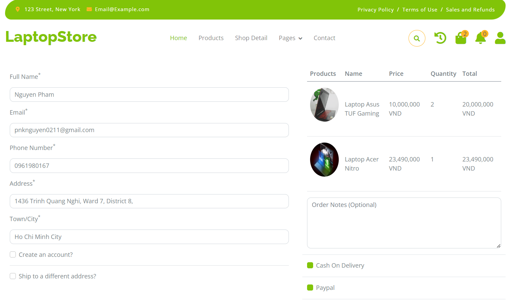

# Laptop Store Project

## Table of Contents
- [Introduction](#introduction)
- [Features](#features)
- [Technologies Used](#technologies-used)
- [Getting Started](#getting-started)
- [Installation](#installation)
- [Usage](#usage)
- [Contributing](#contributing)
- [License](#license)
- [Contact](#contact)

## Introduction

Laptop Store is a comprehensive e-commerce platform designed for selling laptops and related accessories. With a user-friendly interface and robust backend, it provides a seamless shopping experience for customers and efficient management tools for administrators.

<p align="center">
  
</p>

## Features

### For Customers
- Browse a wide range of laptops with detailed specifications
- Advanced search and filter options (by brand, price range, purpose)
- User account creation and management
- Shopping cart functionality
- Secure checkout process
- Order tracking

### Demo Images:

<p align="center">
  
  
   
   
</p>


### For Administrators
- Product management (add, edit, delete)
- Order management
- User management
- Sales analytics and reporting

## Technologies Used

- **Backend:**
  - Java Spring MVC
  - Spring Boot
  - Spring Data JPA
  - Spring Security
  - Spring Session
  - Hibernate
- **Frontend:**
  - JSP (Java Server Pages)
  - HTML5
  - CSS3
  - JavaScript
- **Database:**
  - MySQL
- **Other:**
  - Maven (for dependency management)
  - Git (for version control)

## Getting Started

These instructions will get you a copy of the project up and running on your local machine for development and testing purposes.

### Prerequisites

- JDK 11 or later
- Maven 3.6 or later
- MySQL 8.0 or later

### Installation

1. Clone the repository
   ```
   git clone https://github.com/khnguyen0211/laptop-store.git
   ```

2. Navigate to the project directory
   ```
   cd laptop-store
   ```

3. Configure the database
   - Create a MySQL database named `laptop_store`
   - Update `src/main/resources/application.properties` with your database credentials

4. Build the project
   ```
   mvn clean install
   ```

5. Run the application
   ```
   mvn spring-boot:run
   ```

6. Access the application at `http://localhost:8080`

## Usage

[Include screenshots or GIFs demonstrating key features of your application]

### Customer Interface

1. **Browse Products:** Navigate through the product catalog using the menu or search functionality.
2. **Filter Products:** Use the sidebar to filter products by brand, price range, or intended use.
3. **Add to Cart:** Click on the "Add to Cart" button to add items to your shopping cart.
4. **Checkout:** Proceed to checkout, fill in your details, and complete the purchase.

### Admin Interface

1. **Login:** Access the admin panel at `http://localhost:8080/admin` using your admin credentials.
2. **Manage Products:** Add, edit, or remove products from the catalog.
3. **Process Orders:** View and manage customer orders.
4. **User Management:** Manage customer accounts and admin access.

## Contributing

We welcome contributions to the Laptop Store project! Please read our [CONTRIBUTING.md](CONTRIBUTING.md) for details on our code of conduct and the process for submitting pull requests.

## License

This project is licensed under the MIT License - see the [LICENSE.md](LICENSE.md) file for details.

## Contact

Project Link: [https://github.com/khnguyen0211/laptop-store](https://github.com/khnguyen0211/laptop-store)

For any queries, please contact [pnknguyen0211@gmail.com](mailto:pnknguyen0211@gmail.com)